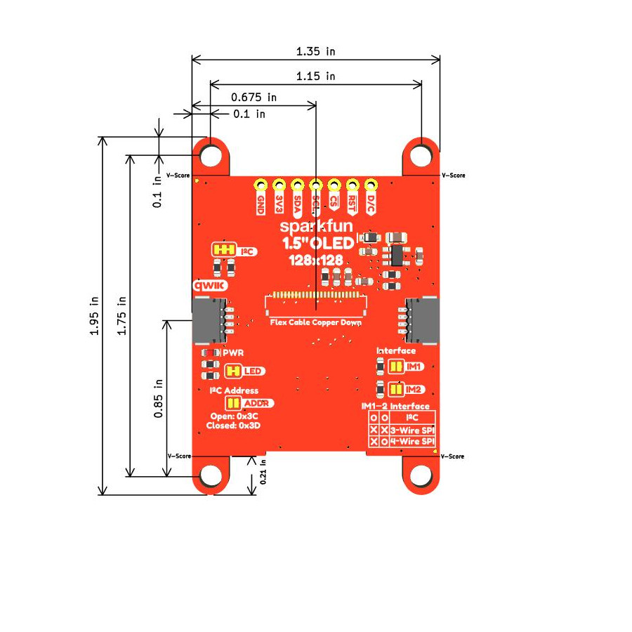

Let's take a closer look at the OLED and other hardware included on this breakout board.

## WEO128128HWAP3N00000 OLED

This COG (Chip on Glass) OLED display from Winstar Displays is a 1.5" square monochrome white on black display. It has a 128x128 pixel dot matrix display with an active area of 28.86mm x 28.86mm. 

This OLED uses the CH1120 display driver IC. The board also includes a AP3012 boost circuit to output 12V to boost the contrast of the OLED.

## Connectors

## Power

The board's power is supplied through either one of the Qwiic connectors or through the dedicated PTH power pins (3.3V and GND). The board expects a supply voltage of 3.3V and runs at the same logic level. 

## LED

The sole LED on the board is a red LED labeled PWR. This LED illuminates when the 3.3V rail is powered.

## Solder Jumpers

This Qwiic OLED Display has five solder jumpers labeled <b>IM1</b>, <b>IM2</b>, <b>ADDR</b>, <b>LED</b> and <b>I2C</b>. The list below outlines the functionality of each jumper along with notes on their use.

* <b>IM1</b>/<b>IM2</b> - These two jumpers control the communication interface to the OLED. With both jumpers OPEN the OLED communicates over I2C. With both jumpers CLOSED the OLED communicates over SPI. Both jumpers are OPEN by default to enable the I2C interface. Both jumpers must be in the same state for either communication interface.
* <b>ADDR</b> - The ADDR jumper sets the I2C address of the OLED. The jumper is OPEN by default and sets the I2C address to <b>0x3C</b>. Close the solder jumper to change the address to <b>Ox3D</b>.
* <b>LED</b> - This solder jumper completes the power LED circuit to enable the red power LED. It is CLOSED by default. Open the jumper to disable the power LED if needed.
* <b>I2C - This three-way solder jumper pulls the I2C lines (SDA and SCL) to <b>3.3V</b> through a pair of <b>2.2k&ohm;</b> resistors. Open the jumper completely to disable the pullups on these lines.

## Board Dimensions

The main dimensions of the Qwiic OLED Display measure 1.350" x 1.475" (34.290mm x 37.465) and it has four mounting standoffs outside the main dimensions that fit a 4-40 screw.

<figure markdown>
[{ width="600"}](./assets/board_files/SparkFun_Qwiic_OLED_1.5in.jpg "Click to enlarge")
</figure>